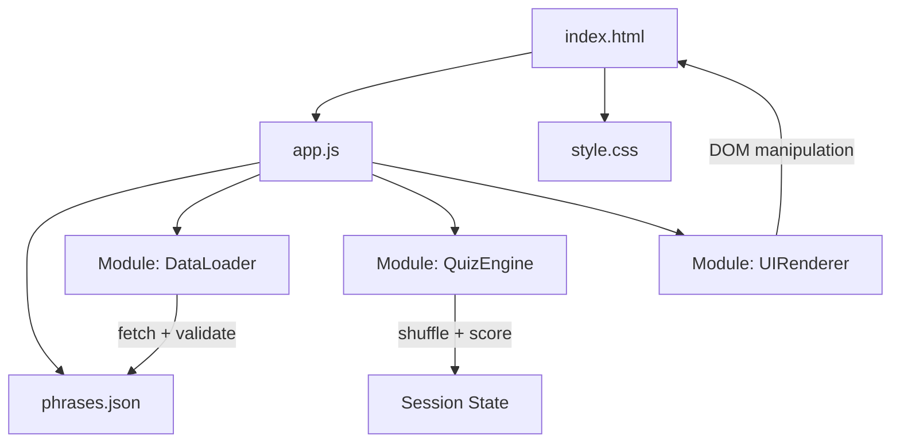

# Design — Quiz de Grammaire Française CE2

## Overview

Application SPA vanilla (HTML/CSS/JS, sans framework ni outil de build) hébergée dans `static/tm/` d'un site Hugo. L'application charge un fichier JSON contenant 1000 phrases françaises de niveau CE2, chacune avec exactement une erreur grammaticale. L'élève clique sur le mot erroné parmi les mots affichés. Une session = 20 questions aléatoires, avec score final et récapitulatif.

### Décisions de conception

- **Vanilla JS uniquement** : pas de React, Vue, ni build step. Un seul fichier `index.html` + un `app.js` + un `style.css` + un `phrases.json`.
- **Données statiques** : les 1000 phrases sont dans `phrases.json`, chargé via `fetch()` au démarrage.
- **Pas de backend** : tout est côté client, pas de persistance serveur.
- **Randomisation** : `Math.random()` + Fisher-Yates shuffle pour tirer 20 phrases sans doublon par session.

## Architecture



L'architecture est un simple MVC côté client :

- **DataLoader** : charge et valide `phrases.json`
- **QuizEngine** : gère la logique de session (sélection aléatoire, vérification des réponses, calcul du score)
- **UIRenderer** : gère l'affichage des 3 écrans (accueil, question, résultat)

Tout est dans un seul fichier `app.js` organisé en fonctions. Pas de modules ES6 (compatibilité maximale).

## Components and Interfaces

### Structure des fichiers

```
static/tm/
├── index.html           # Point d'entrée HTML
├── app.js               # Logique applicative
├── style.css            # Styles
├── phrases.json         # Banque principale (3000+ phrases courtes)
```

### DataLoader

```javascript
/**
 * Charge phrases.json et valide la structure.
 * @returns {Promise<Array<Phrase>>} Tableau de 1000 phrases validées
 */
async function loadPhrases() { ... }

/**
 * Valide qu'une phrase a exactement un mot erroné à l'index spécifié.
 * @param {Phrase} phrase
 * @returns {boolean}
 */
function validatePhrase(phrase) { ... }
```

### QuizEngine

```javascript
/**
 * Sélectionne 20 phrases aléatoires sans doublon (Fisher-Yates).
 * @param {Array<Phrase>} allPhrases
 * @returns {Array<Phrase>}
 */
function selectSessionPhrases(allPhrases) { ... }

/**
 * Vérifie si le mot cliqué est le mot erroné.
 * @param {Phrase} phrase
 * @param {number} clickedIndex - Index du mot cliqué
 * @returns {boolean}
 */
function checkAnswer(phrase, clickedIndex) { ... }

/**
 * Découpe une phrase en mots cliquables.
 * @param {string} sentence
 * @returns {Array<string>}
 */
function splitSentence(sentence) { ... }
```

### UIRenderer

```javascript
/** Affiche l'écran d'accueil avec bouton "Commencer" */
function showWelcomeScreen() { ... }

/** Affiche une question : phrase avec mots cliquables + progression */
function showQuestionScreen(phrase, questionNumber, totalQuestions) { ... }

/** Affiche le feedback après un clic (correct/incorrect + explication) */
function showFeedback(phrase, wasCorrect) { ... }

/** Affiche l'écran de résultat avec score et récapitulatif */
function showResultScreen(results, score, total) { ... }
```

## Data Models

### Fichiers de phrases

L'application utilise deux fichiers JSON de phrases, tous deux au même format :

| Fichier                | Nombre | IDs         | Description                                                    |
|------------------------|--------|-------------|----------------------------------------------------------------|
| `phrases.json`         | 2650   | 1–2650      | Banque principale, phrases courtes, toutes catégories          |
| `phrases-longues.json` | 300    | 3001–3300   | Phrases longues avec pronoms et verbes pouvoir/vouloir         |

### Schéma JSON — Phrase

Chaque fichier est un tableau JSON (`Array<Phrase>`). Chaque élément respecte le schéma suivant :

#### Phrase avec erreur (`errorIndex ≥ 0`)

```json
{
  "id": 1,
  "sentence": "Les chat mange du poisson.",
  "errorIndex": 1,
  "correctedWord": "chats",
  "explanation": "Après le déterminant pluriel « les », le nom doit être au pluriel : « chats » et non « chat ».",
  "category": "accords en nombre"
}
```

#### Phrase correcte (`errorIndex === -1`)

```json
{
  "id": 2665,
  "sentence": "Les chats dorment sur le lit et ils y restent toute la journée sans bouger.",
  "errorIndex": -1,
  "correctedWord": "",
  "explanation": "La phrase est correcte : « ils » reprend « les chats » et « y » reprend « sur le lit ».",
  "category": "pronoms"
}
```

#### Champs

| Champ           | Type     | Requis | Description                                                                                         |
|-----------------|----------|--------|-----------------------------------------------------------------------------------------------------|
| `id`            | `number` | oui    | Identifiant unique (entier, unique dans le fichier)                                                 |
| `sentence`      | `string` | oui    | Phrase complète. Contient exactement une erreur si `errorIndex ≥ 0`, aucune si `errorIndex === -1`  |
| `errorIndex`    | `number` | oui    | Index (0-based) du mot erroné dans `sentence.split(" ")`. Vaut `-1` si la phrase est correcte       |
| `correctedWord` | `string` | oui    | Le mot corrigé (chaîne vide `""` si `errorIndex === -1`)                                            |
| `explanation`   | `string` | oui    | Explication pédagogique (toujours présente, même pour les phrases correctes)                        |
| `category`      | `string` | oui    | Catégorie grammaticale (voir liste ci-dessous)                                                      |

#### Règles de validation

1. `id` doit être un entier unique dans le fichier
2. `sentence` doit être une chaîne non vide
3. Si `errorIndex === -1` : la phrase est correcte, `correctedWord` doit être `""`
4. Si `errorIndex ≥ 0` : `errorIndex` doit être un entier valide dans `sentence.split(" ")` (0 ≤ errorIndex < nombre de mots), et `correctedWord` doit être une chaîne non vide
5. `explanation` et `category` doivent être des chaînes non vides

#### Catégories grammaticales

| Catégorie                        | Présente dans              |
|----------------------------------|----------------------------|
| `accords sujet-verbe`            | phrases.json,  |
| `accords en genre`               | phrases.json,  |
| `accords en nombre`              | phrases.json,  |
| `homophones a/à`                 | phrases.json,  |
| `homophones et/est`              | phrases.json,  |
| `homophones on/ont`              | phrases.json,  |
| `homophones son/sont`            | phrases.json,  |
| `homophones ou/où`               | phrases.json,  |
| `homophones ce/se`               | phrases.json,  |
| `présent`                        | phrases.json,  |
| `futur`                          | phrases.json,  |
| `pluriel des noms`               | phrases.json,  |
| `féminin des adjectifs`          | phrases.json,  |
| `déterminants`                   | phrases.json,  |
| `pronoms`                        | phrases.json,  |
| `conjugaison pouvoir présent`    | phrases.json                       |
| `conjugaison pouvoir futur`      | phrases.json                       |
| `conjugaison vouloir présent`    | phrases.json                       |
| `conjugaison vouloir futur`      | phrases.json                       |

### Session State (en mémoire JS)

```javascript
const sessionState = {
  phrases: [],        // Array<Phrase> — les 20 phrases sélectionnées
  currentIndex: 0,    // Index de la question courante (0-19)
  score: 0,           // Nombre de bonnes réponses
  results: []         // Array<{phrase, selectedIndex, wasCorrect}>
};
```

### Catégories grammaticales CE2

Les 1000 phrases couvrent ces catégories (répartition approximative) :

| Catégorie                    | ~Nombre |
|------------------------------|---------|
| Accords sujet-verbe          | ~100    |
| Accords en genre             | ~80     |
| Accords en nombre            | ~80     |
| Homophones (a/à)             | ~70     |
| Homophones (et/est)          | ~70     |
| Homophones (on/ont)          | ~70     |
| Homophones (son/sont)        | ~70     |
| Homophones (ou/où)           | ~60     |
| Homophones (ce/se)           | ~60     |
| Conjugaison présent          | ~60     |
| Conjugaison futur            | ~50     |
| Conjugaison imparfait        | ~50     |
| Conjugaison passé composé    | ~50     |
| Pluriel des noms             | ~50     |
| Féminin des adjectifs        | ~40     |
| Déterminants                 | ~40     |


## Correctness Properties

*A property is a characteristic or behavior that should hold true across all valid executions of a system — essentially, a formal statement about what the system should do. Properties serve as the bridge between human-readable specifications and machine-verifiable correctness guarantees.*

### Property 1: Phrase structural validity

*For any* phrase in the bank, it must contain all required fields (`id`, `sentence`, `errorIndex`, `correctedWord`, `explanation`, `category`), and `errorIndex` must be a valid 0-based index within the words produced by splitting `sentence` on spaces.

**Validates: Requirements 1.2, 1.3**

### Property 2: Session selection returns 20 unique phrases

*For any* phrase bank of size ≥ 20, calling `selectSessionPhrases` must return exactly 20 phrases, all distinct (no duplicates).

**Validates: Requirements 1.1 (implicit session requirement)**

### Property 3: Answer checking correctness

*For any* phrase and any word index, `checkAnswer(phrase, index)` returns `true` if and only if `index === phrase.errorIndex`.

**Validates: Requirements 1.3**

### Property 4: Sentence splitting consistency

*For any* phrase, `splitSentence(phrase.sentence)[phrase.errorIndex]` must equal the erroneous word present in the original sentence at that position.

**Validates: Requirements 1.2, 1.3**

### Property 5: Score invariant

*For any* sequence of quiz results, the final score must equal the count of entries where `wasCorrect === true`.

**Validates: Requirements 1.1 (implicit scoring requirement)**

## Error Handling

| Situation                          | Comportement                                                        |
|------------------------------------|---------------------------------------------------------------------|
| `phrases.json` ne charge pas       | Afficher un message d'erreur clair à l'écran d'accueil              |
| JSON invalide / mal formé          | Afficher un message d'erreur, ne pas démarrer de session            |
| Phrase avec `errorIndex` hors limites | Ignorer la phrase lors du chargement, logger en console           |
| Moins de 20 phrases valides        | Afficher un message d'erreur, impossible de démarrer                |
| Clic multiple rapide sur les mots  | Ignorer les clics après le premier sur une question donnée          |

## Testing Strategy

### Tests unitaires

Tests spécifiques pour les cas concrets et les edge cases :

- `phrases.json` contient exactement 1000 entrées
- Toutes les catégories CE2 requises sont présentes dans la banque
- `splitSentence` gère correctement la ponctuation attachée aux mots (ex: "poisson." → "poisson.")
- `showResultScreen` affiche le bon score pour un scénario connu (ex: 15/20)
- Comportement quand la banque contient exactement 20 phrases (cas limite)

### Tests property-based

Bibliothèque : **fast-check** (JavaScript)

Chaque test property-based doit :
- Exécuter au minimum 100 itérations
- Référencer la propriété du design avec un tag au format : `Feature: french-grammar-quiz-ce2, Property {N}: {titre}`
- Être implémenté par un SEUL test property-based par propriété

| Property | Test                                                                                     |
|----------|------------------------------------------------------------------------------------------|
| 1        | Générer des objets phrase aléatoires, vérifier structure + validité de `errorIndex`       |
| 2        | Générer des banques de phrases aléatoires (≥20), vérifier 20 résultats uniques           |
| 3        | Générer des phrases + index aléatoires, vérifier `checkAnswer` ↔ `errorIndex`            |
| 4        | Générer des phrases aléatoires, vérifier que `splitSentence` indexe correctement          |
| 5        | Générer des séquences de résultats aléatoires, vérifier score = count(correct)            |

Les tests unitaires et property-based sont complémentaires : les unit tests vérifient des cas concrets et edge cases, les property tests vérifient les invariants universels sur des entrées aléatoires.
